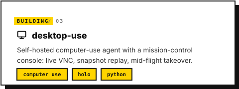
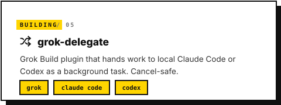
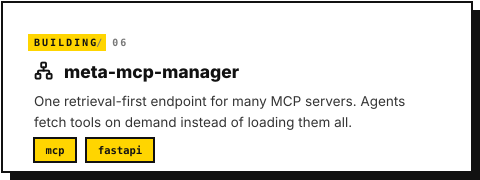
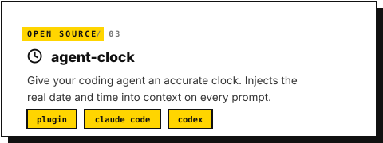

<div align="center">

<a href="https://github.com/arthurkatcher"></a>

</div>

# Hey, I'm Arthur 👋

<div align="center">
<a href="https://arthurkatcher.com"></a>
</div>

<div align="center">
<a href="https://github.com/arthurkatcher"></a>
</div>

## Building

<div align="center">
<a href="https://qoris.ai"></a>
<a href="https://github.com/arthurkatcher/agentparts"></a>
<a href="https://github.com/arthurkatcher/desktop-use"></a>
<a href="https://github.com/arthurkatcher/desktop-sandbox"></a>
<a href="https://github.com/arthurkatcher/grok-delegate"></a>
<a href="https://github.com/arthurkatcher/meta-mcp-manager"></a>
</div>

## Stack

<div align="center">

</div>

## Professional Journey

<div align="center">

</div>

## Open Source

<div align="center">
<a href="https://github.com/qoris-ai/knox"></a>
<a href="https://github.com/arthurkatcher/google-maps-mcp"></a>
<a href="https://github.com/arthurkatcher/agent-clock"></a>
<a href="https://github.com/arthurkatcher/x-search-via-hermes"></a>
<a href="https://github.com/arthurkatcher/xai-voice-agent"></a>
<a href="https://github.com/arthurkatcher/holo-desktop-cli"></a>
</div>

---

<div align="center">

<a href="https://arthurkatcher.com"></a> &nbsp;&nbsp; <a href="https://x.com/arthurkatcher"></a> &nbsp;&nbsp; <a href="https://qoris.ai"></a>

<a href="https://github.com/arthurkatcher"></a>

</div>

## Try something

<div align="center">
<a href="https://github.com/qoris-ai/knox"></a>
&nbsp;&nbsp;
<a href="https://github.com/arthurkatcher/google-maps-mcp"></a>
<br/>
<sub>Copy a command. Knox guards every agent session; gmaps-mcp runs anywhere MCP does.</sub>
</div>

```bash
claude plugin marketplace add qoris-ai/qoris-marketplace && claude plugin install knox@qoris
uvx gmaps-mcp
```
