## About me

<div align="center">
<a href="https://arthurkatcher.com"></a>
</div>

## Building

<div align="center">
<a href="https://qoris.ai"><picture><source media="(prefers-color-scheme: dark)" srcset="assets/qoris-dark.svg">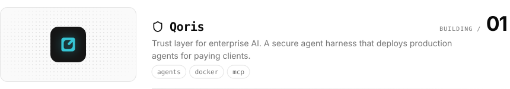</picture></a>
<a href="https://github.com/arthurkatcher/agentparts"><picture><source media="(prefers-color-scheme: dark)" srcset="assets/agentparts-dark.svg">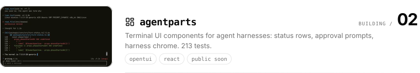</picture></a>
<a href="https://github.com/arthurkatcher/desktop-use"><picture><source media="(prefers-color-scheme: dark)" srcset="assets/desktop-use-dark.svg">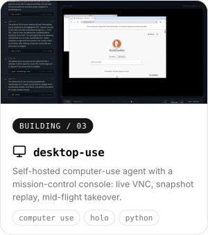</picture></a>
<a href="https://github.com/arthurkatcher/desktop-sandbox"><picture><source media="(prefers-color-scheme: dark)" srcset="assets/desktop-sandbox-dark.svg">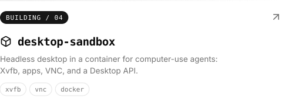</picture></a>
<a href="https://github.com/arthurkatcher/grok-delegate"><picture><source media="(prefers-color-scheme: dark)" srcset="assets/grok-delegate-dark.svg">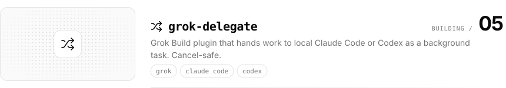</picture></a>
<a href="https://github.com/arthurkatcher/meta-mcp-manager"><picture><source media="(prefers-color-scheme: dark)" srcset="assets/meta-mcp-dark.svg">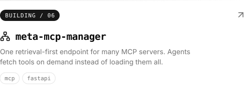</picture></a>
</div>

## Stack

<div align="center">
<picture><source media="(prefers-color-scheme: dark)" srcset="assets/stack-dark.svg">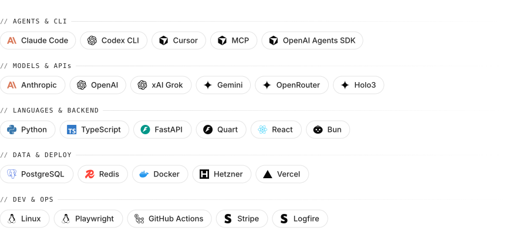</picture>
</div>

## Professional Journey

<div align="center">
<picture><source media="(prefers-color-scheme: dark)" srcset="assets/journey-dark.svg">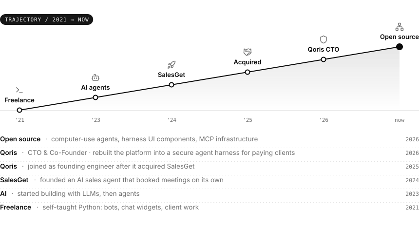</picture>
</div>

## Open Source

<div align="center">
<a href="https://github.com/qoris-ai/knox"><picture><source media="(prefers-color-scheme: dark)" srcset="assets/knox-dark.svg">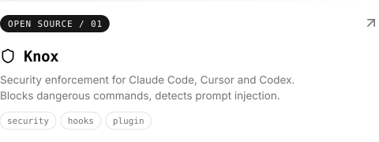</picture></a>
<a href="https://github.com/arthurkatcher/google-maps-mcp"><picture><source media="(prefers-color-scheme: dark)" srcset="assets/gmaps-dark.svg">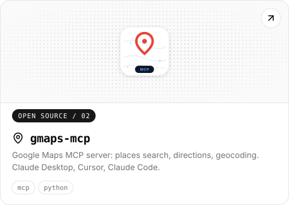</picture></a>
<a href="https://github.com/arthurkatcher/x-search-via-hermes"><picture><source media="(prefers-color-scheme: dark)" srcset="assets/x-search-dark.svg">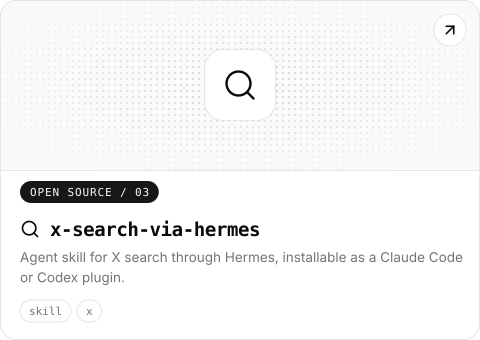</picture></a>
<a href="https://github.com/arthurkatcher/agent-clock"><picture><source media="(prefers-color-scheme: dark)" srcset="assets/agent-clock-dark.svg">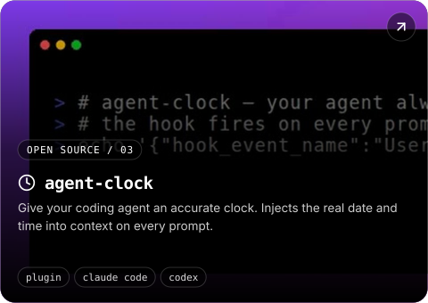</picture></a>
<a href="https://github.com/arthurkatcher/xai-voice-agent"><picture><source media="(prefers-color-scheme: dark)" srcset="assets/voice-dark.svg">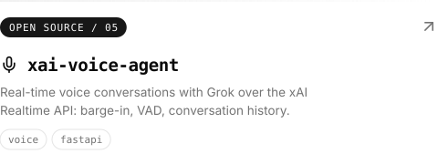</picture></a>
<a href="https://github.com/arthurkatcher/holo-desktop-cli"><picture><source media="(prefers-color-scheme: dark)" srcset="assets/holo-cli-dark.svg">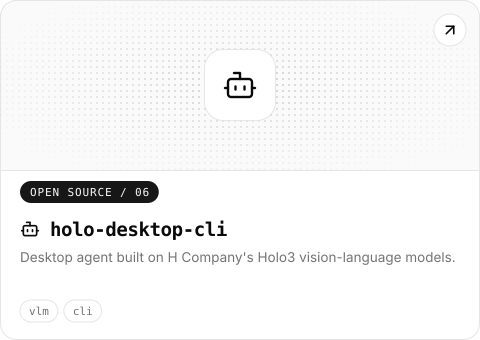</picture></a>
<a href="https://github.com/arthurkatcher/explainer-video"><picture><source media="(prefers-color-scheme: dark)" srcset="assets/explainer-dark.svg">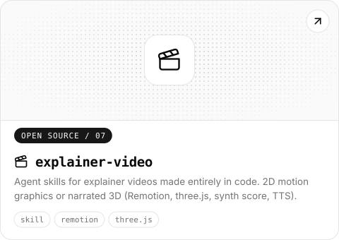</picture></a>
<a href="https://github.com/arthurkatcher/jev-realm-of-iron"><picture><source media="(prefers-color-scheme: dark)" srcset="assets/jev-dark.svg">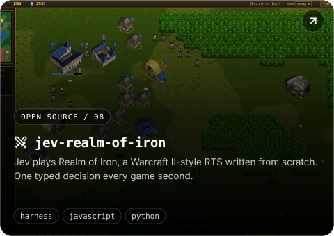</picture></a>
<br/>
<sub>Merged PRs into OpenClaw's plugin registry (9K stars) and H Company's computer-use CLI; found a scraping bug in Firecrawl's Python SDK (158K stars) and proposed a fix, which got accepted.</sub>
</div>

## Activity Graph

<div align="center">
<a href="https://github.com/arthurkatcher">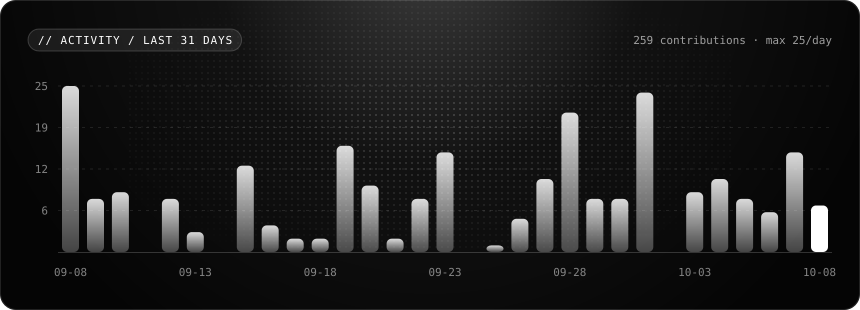</a>
</div>

## Try something

<div align="center">
<a href="https://github.com/qoris-ai/knox"><picture><source media="(prefers-color-scheme: dark)" srcset="assets/card-knox-dark.svg">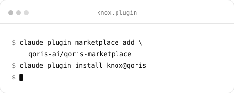</picture></a>
&nbsp;&nbsp;
<a href="https://github.com/arthurkatcher/google-maps-mcp"><picture><source media="(prefers-color-scheme: dark)" srcset="assets/card-gmaps-dark.svg">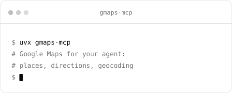</picture></a>
<br/>
<sub>Copy a command. Knox guards every agent session; gmaps-mcp runs anywhere MCP does.</sub>
</div>

```bash
claude plugin marketplace add qoris-ai/qoris-marketplace && claude plugin install knox@qoris
uvx gmaps-mcp
```

---

<div align="center">

<a href="https://arthurkatcher.com"><picture><source media="(prefers-color-scheme: dark)" srcset="assets/link-web-dark.svg"></picture></a> &nbsp;&nbsp; <a href="https://x.com/arthurkatcher"><picture><source media="(prefers-color-scheme: dark)" srcset="assets/link-x-dark.svg"></picture></a> &nbsp;&nbsp; <a href="https://qoris.ai"><picture><source media="(prefers-color-scheme: dark)" srcset="assets/link-qoris-dark.svg"></picture></a>

</div>
